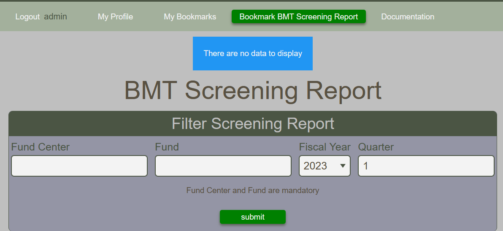
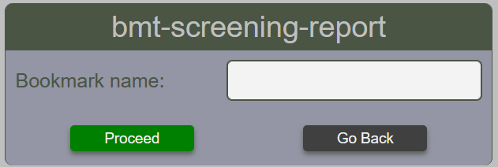
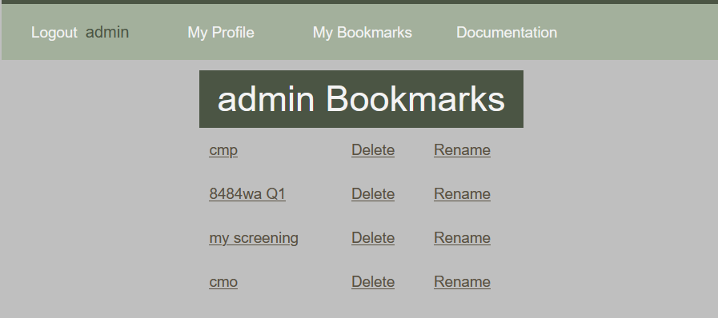

# Bookmarking

## Creating a bookmark
Most pages, including reports, can be bookmarked for faster future reference. When a BFT page can be bookmarked, a green button is displayed on the main toolbal as shown below.

<figure markdown>
<figcaption>Create a bookmark button from the main toolbar</figcaption>

</figure>

When the user clicks on the bookmark create button, the user is asked to give the bookmark a name.  Chose something that is meaning ful to you.

<figure markdown>
<figcaption>Giving a name to the page to be bookmarked</figcaption>

</figure>

## Viewing Bookmarks
Each user has a link called **My Bookmarks** located in the main toolbar.  From the user bookmark view, bookmarks can me renamed or deleted.  Bookmarks cannot be modified.

!!! Warning "When you choose to delete a bookmark, there is no confirmation message.  Bookmark is erased immediately"

<figure markdown>
<figcaption>A typical user bookmark list</figcaption>

</figure>
