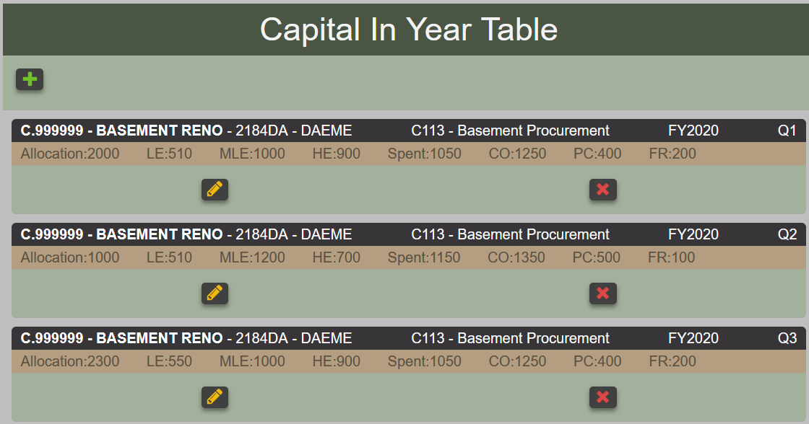
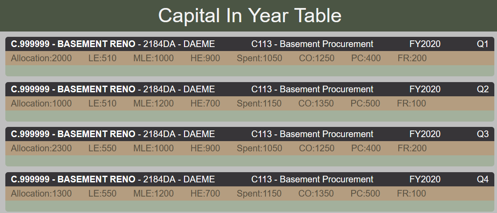
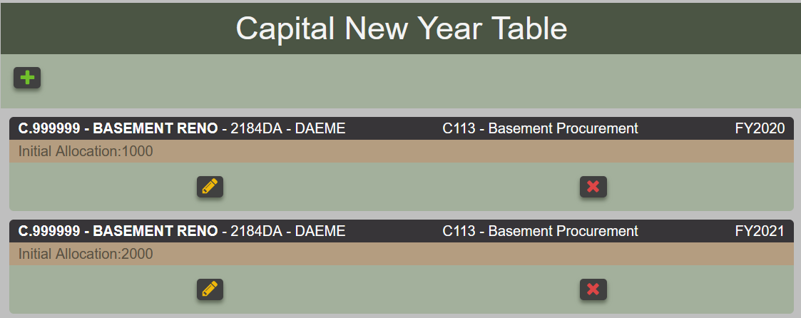
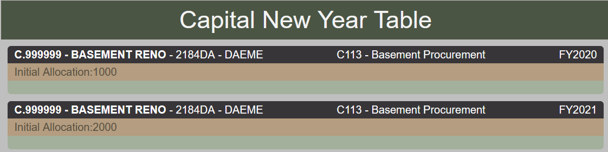
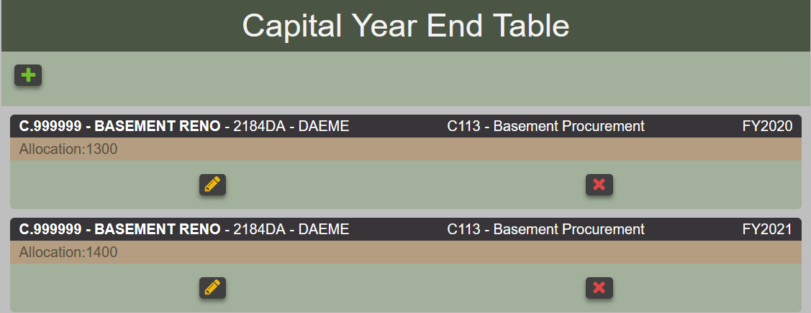
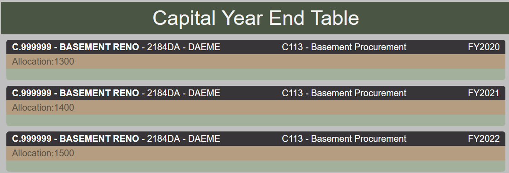

# Capital Forecasting

## Overview

Capital forecasting can be broken down into *New Year*, *In Year*, and *Year End*. Each have common fields : fund, fy, capital project, commit item and notes.

New Year capital forecasting contains the initial allocation.

In Year capital forecasting contains quarterly data for the following:

- allocation,
- spent,
- commitment,
- pre-commitment,
- fund reservation,
- low estimates,
- most likely estimates, and
- high estimates

Year end capital forecasting contains the year end spent.

## View Capital Forecasting

*Viewing Capital Forecasting In Year in edit mode*

*Viewing Capital Forecasting In Year in read only mode*

*Viewing capital forecasting New Year in edit mode*

*Viewing capital forecasting New Year in read only mode*

*Viewing capital forecasting Year End in edit mode*

*Viewing capital forecasting Year End in read only mode*

## Upload Capital Forecasting

###  In Year

### New Year

### Year End
## Delete Capital Forecasting
