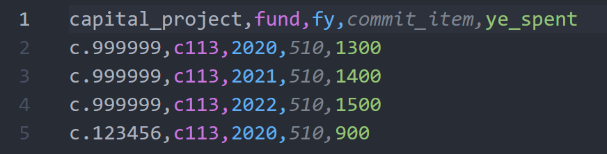

# Capital Projects

## Viewing Capital Projects

Capital projects can be viewed by anyone.  The report will appear different
whether or not the user is permitted to create, update or delete
capital projects.

*Viewing Capital Project in edit mode*

*Viewing Capital Project in read only mode*

## Create Capital Project
Creating a capital project requires the project number, it's name and the parent fund center.  The fund center must be created first if it does not exists.

Checking the Is Updatable field ensures that the capital project's encumbrance will be updated during the DRMIS download.

Optionally select a procurement officer.  The selected procurement officer will be paired to the lines items that are under the given capital project.

<figure markdown>
<figcaption>
Capital project form for creating and updating data
</figcaption>

</figure>

## Delete Capital Project

A confirmation dialog will appear before proceding with a delete action.  Once the project is deleted, the user is redirected to the Capital Project View.

*Confirm the Fund Center deletion*

## Upload Capital Project

!!! Note

    These operations requires administration privileges.

### New Year Upload
The new Year upload allows for fixing the allocations of each project for a given fund.

#### Source File

The New Year source file must contain 4 columns as shown in the sample below.  All fields are mandatory.  The columns initial_allocation and commit_item can be set to 0 if desired.

<figure markdown>
<figcaption>
Capital Forecasting New Year Source File Sample
</figcaption>

</figure>

#### Warning Messages

!!! Warning "Project c.123456 does not exist, no capital forecasts have been recorded."
    Your source file contains a project number that is not found in the database. Upload will fail if a project in the source file does not exist.

!!! Warning " New year capital project forecast upload. Invalid columns header"
    Upload will fail because it contains an invalid column header.  Verify the first row of the source file.  Maybe you selected the wrong file.

!!! Warning "Saving New Year Capital Forecasting C.999999 - BASEMENT RENO - 2020 - C113 generates UNIQUE constraint failed: bft_capitalnewyear.fund_id, bft_capitalnewyear.capital_project_id, bft_capitalnewyear.commit_item, bft_capitalnewyear.fy."

    Your project database already contains a New Year allocation for the specified project, FY and fund.

### In Year Upload

The In Year upload allows for recording on a quarterly basis the encumbrance, allocation, estimates and encumbrance of each capital project.

#### Source File

The In Year source file must contain 12 columns as shown in the sample below.

<figure markdown>
<figcaption>
Capital Forecasting In Year Source file Sample
</figcaption>

</figure>

#### Warning Messages

!!! Warning "Project c.123456 does not exist, no capital forecasts have been recorded."
    Your source file contains a project number that is not found in the database. Upload will fail if a project in the source file does not exist.

!!! Warning " New year capital project forecast upload. Invalid columns header"
    Upload will fail because it contains an invalid column header.  Verify the first row of the source file.  Maybe you selected the wrong file.

!!! Warning "Saving In Year Capital Forecasting C.999999 - BASEMENT RENO - 2020 - C113 generates UNIQUE constraint failed: bft_capitalinyear.fund_id, bft_capitalinyear.capital_project_id, bft_capitalinyear.commit_item, bft_capitalinyear.fy, bft_capitalinyear.quarter."

    Your project database already contains a New Year allocation for the specified project, FY and fund.

### Year End Upload
The Year End Upload allows for recording the Year End Spent of each capital project by fund.

#### Source File

<figure markdown>
<figcaption>
Capital Forecasting Year End Source File Sample
</figcaption>

</figure>

#### Year End Messages

!!! Warning "Project c.123456 does not exist, no capital forecasts have been recorded."
    Your source file contains a project number that is not found in the database. Upload will fail if a project in the source file does not exist.

!!! Warning " New year capital project forecast upload. Invalid columns header"
    Upload will fail because it contains an invalid column header.  Verify the first row of the source file.  Maybe you selected the wrong file.

!!! Warning "Saving Year End Capital Forecasting C.999999 - BASEMENT RENO - 2020 - C113 generates UNIQUE constraint failed: bft_capitalyearend.fund_id, bft_capitalyearend.capital_project_id, bft_capitalyearend.commit_item, bft_capitalyearend.fy."

    Your project database already contains a New Year allocation for the specified project, FY and fund.
