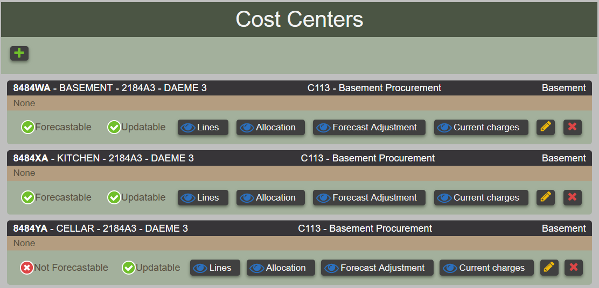
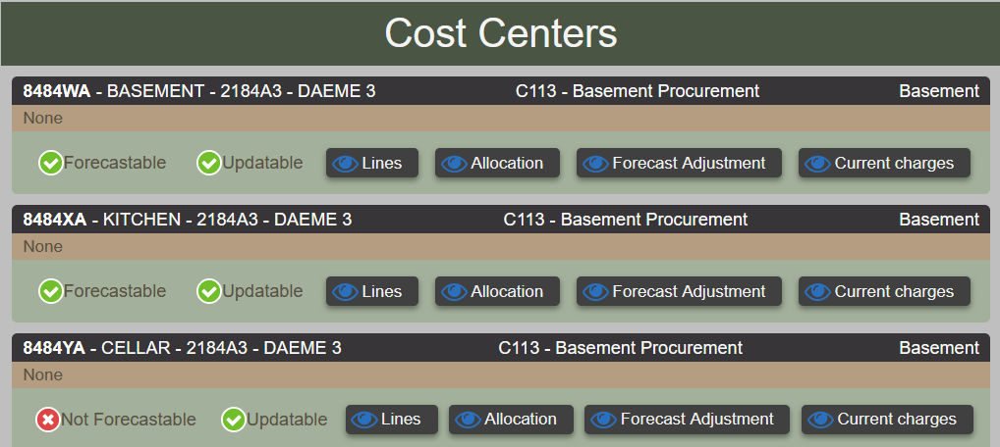
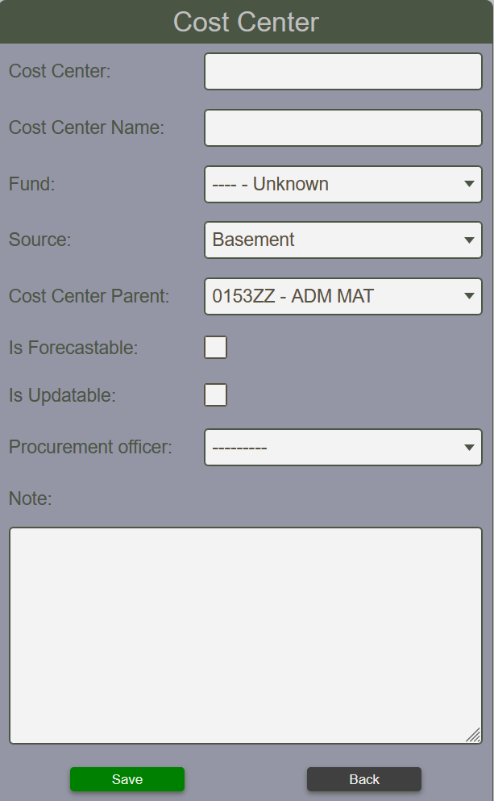
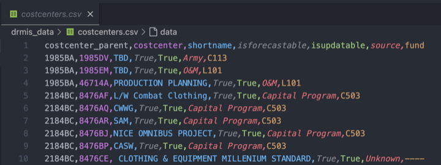
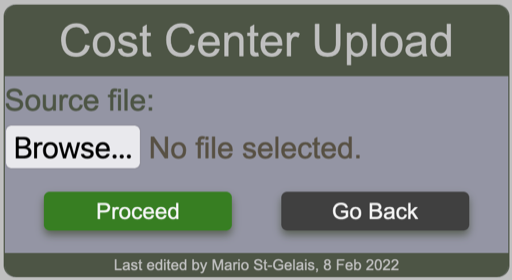
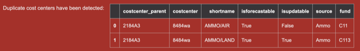

# Cost Centers

## Viewing Cost Centers

Cost centers can be viewed by anyone.  The report will appear different
whether or not the user is permitted to create, update or delete
cost centers.  The cost center view provide direct links to Line items, allocation, forecast adjustment and current charges.

<figure markdown>
<figcaption>
Viewing cost centers in edit mode
</figcaption>

</figure>

<figure markdown>
<figcaption>
Viewing cost centers in read only mode
</figcaption>

</figure>

## Create Cost Center

Creating a cost center requires requires the cost center represented by its
6 characters (1111XX), and its name.  The fund, source and the cost center parent are selection list.  The Is Forecastable option must be checked to
make the line items that belong to be assigned a forecast.  The Is Updatable option must be checked to make the line items populated when the DRMIS download takes place.  A procurement officer can be assigned. This will make all the line items of the given cost center to be referenced to the selected procurement officer.

<figure markdown>
<figcaption>
Cost center form for creating and updating data
</figcaption>

</figure>

## Upload Cost Center

!!! note

    This operation requires administration privileges.

### Source file

The required csv file must contains 7 columns as shown in the sample below.
The first two colummns represents a parent - child relationship. All sources, funds and costcenter_parent (fund centers) must exits in the BFT for the upload to be successful.

<figure markdown>

</figure>

The first row contains the header and the name of the elements in the header must be exactly as shown here. If this is not respected, a warning message will be displayed to notify the user and the operation will abort.

### Cost center upload form

The user select the file containing the cost centers to upload by using the ==cost center upload form==

<figure markdown>

</figure>

#### Upload messages

Upon clicking the proceed button, the BFT will process the request and display any messages according to circumstances. Such as the one below which indicates that the column header in the file are invalid.

!!! warning "Supplying a file that contains invalid column header yields this message"

    Cost centers upload by admin, Invalid columns header"

!!! warning "Using a file that contains cost center that already exist in the system."

    Saving cost center {'costcenter_parent': , 'costcenter': '8484wa', 'shortname': 'AMMO/AIR', 'isforecastable': True, 'isupdatable': False, 'source': , 'fund': } generates UNIQUE constraint failed: costcenter_costcenter.costcenter

!!! Warning "Attempt to use a fund that does not exist in the BFT"

    Cost center 8484wa fund (C11) does not exist, no cost centers have been recorded.

!!! warning "Attempt to use a file that contains more that once a given cost center"

    
    Here, the file contains twice the cost center 8484WA

!!! info "When any cost center has been successfully uploaded, number of cost center uploaded will be indicated"

    2 item(s) have been recorded.
