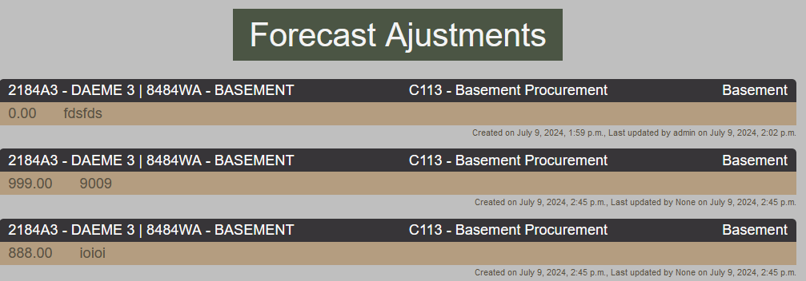
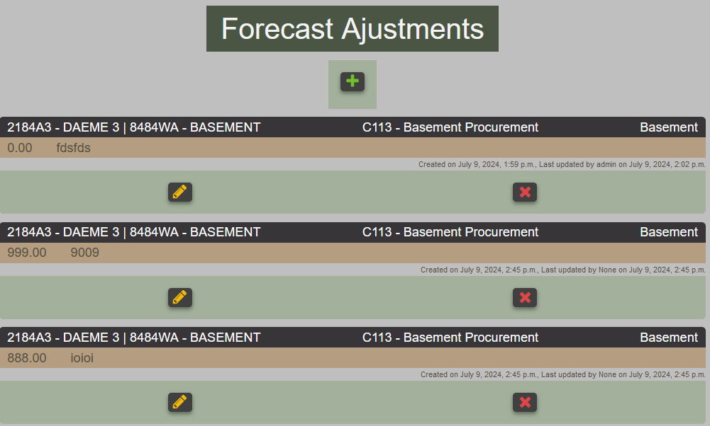
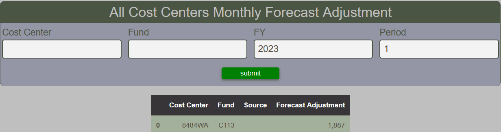
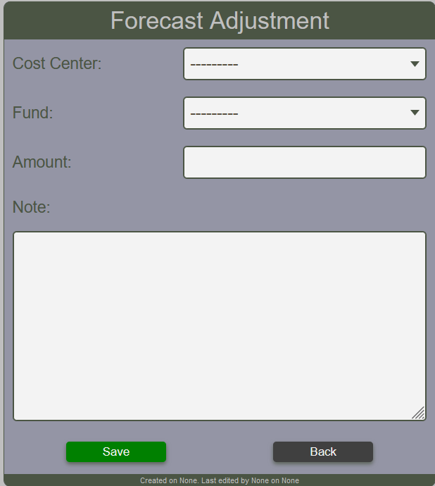
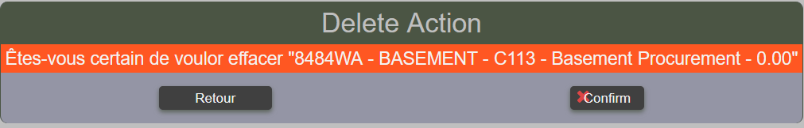

# Forecast Adjustments
Forecast adjustment can be used when it is necessary to fine tune the forecast that results from the
line item forecast.  It is not meant to replace the line item forecast.

Forecast adjustments can be done at the cost center level.  Creating or updating a forecast adjustment
will update the monthly forecast adjustment for the current FY and period.  Deleting a forecast adjustment
has no effect on the monthly forecast adjustment.

All forecast adjustments are deleted at the end of the forecasting review but historical data are kept in
the monthly data.

## Viewing Forecast Adjustments

All current forecast adjustments recorded can be viewed by anyone.  The report will appear different whether
or not the user is permitted to create, update or delete forecast adjustment.

*Read only mode*

*Editable mode*

It is possible to display the monthly forecast adjustment.  This data is for historical purposes and is never
deleted. FY and Period are mandatory fields.

*Viewing monthly forecast adjustments*

## Create a forecast adjustment

Creating a forecast adjustment requires the cost center, the fund and the amount of the adjustment.
The amount can be either positive or negative.  The note is also mendatory.

It is possible to create more than one forecast adjustment for a given cost center and fund.
!!! warning "It is not possible to create a forecast adjustment if the selected cost center does not have line items."

<figure markdown>
<figcaption>Forecast adjustment form for creating and editing data</figcaption>

</figure>

## Delete a forecast adjustment

A confirmation dialog will appear before proceding with the delete action.

*Confirm the forecast adjustment deletion*

