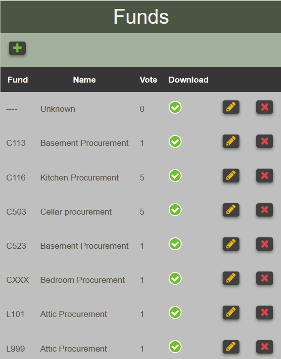
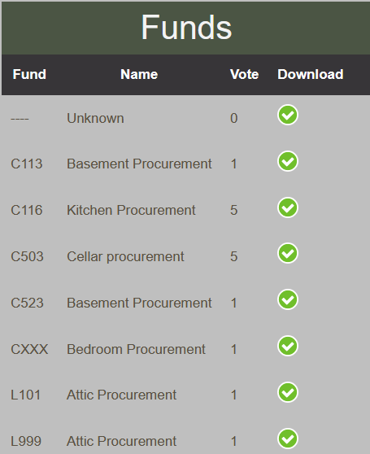

# Funds

Well defined funds are necessary for the BFT to operate.   Many elements such as
cost centers, fund centers, allocations, etc use fund as foreign element.  When a fund
is associated to any of those, the fund cannot be deleted.

## Viewing funds

Funds can be viewed by anyone. The report will appear different whether
or not the user is permitted to create, update or delete funds.

<figure markdown>
<figcaption>Viewing funds in edit mode</figcaption>

</figure>

<figure markdown>
<figcaption>Viewing funds in read only mode</figcaption>

</figure>

## Create fund

Creating a fund requires the fund represented by its four characters (C113, C127, etc.) Its name,
vote.  By default, the Download should be checked.  This indicates the BFT that any line item having
the fund will be downloaded.

<figure markdown>
<figcaption>
Fund form for creating and updating data
</figcaption>

</figure>

## Uploading Funds

!!! note

    This operation requires administration privileges.

The required csv file must contains 3 columns as shown in the sample below.
It is good practice to define an unknown fund using four dashes (----) and a meaningful name to indicate that the fund is unknown.

<figure markdown>

</figure>

The first row contains the header and the name of the elements in the header must be exactly as shown here. If this is not respected, a warning message will be displayed to notify the user and the operation will abort.

The user select the file containing the funds to upload by using the ==fund upload form==

<figure markdown>

</figure>

Upon clicking the proceed button, the BFT will process the request and display any messages according to circumstances. Such as the one below which indicates that the column header in the file are invalid.

!!! warning "Supplying a file that contains invalid column header yields this message"

    Fund upload by admin, Invalid columns header"

!!! warning "Using a file that contains funds that already exist in the system."

    Saving fund {'fund': 'cnn13', 'name': 'National Procurement', 'vote': 1} generates UNIQUE constraint failed: costcenter_fund.fund.

!!! info "When any fund has been successfully uploaded, number of funds uploaded will be indicated"

    2 item(s) have been recorded.
