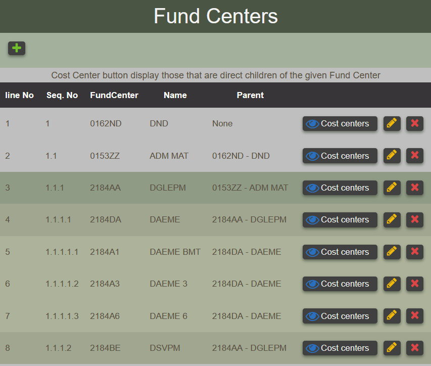
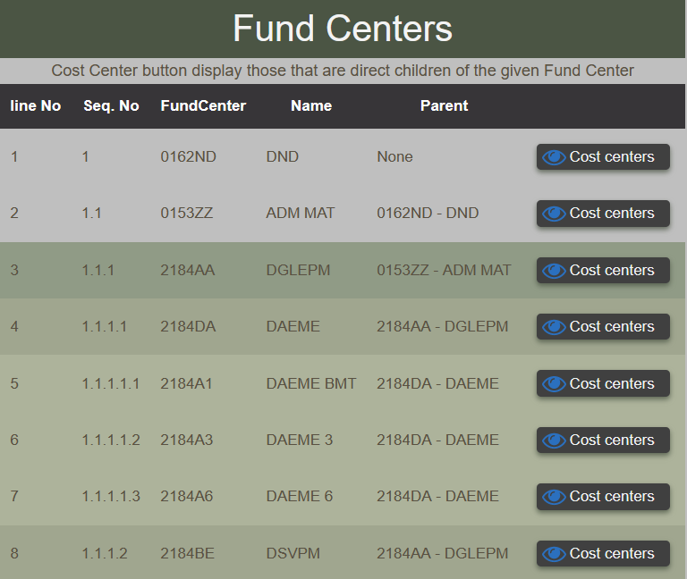
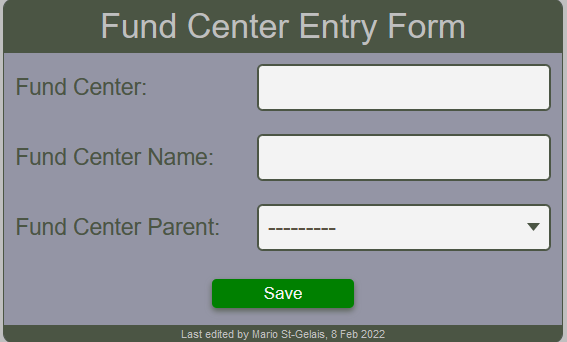
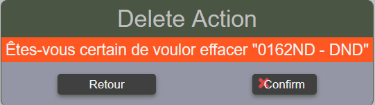
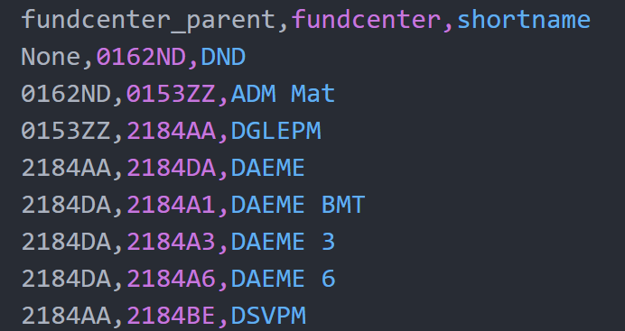
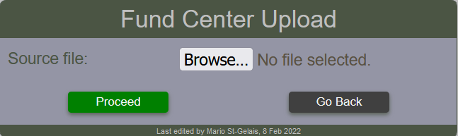
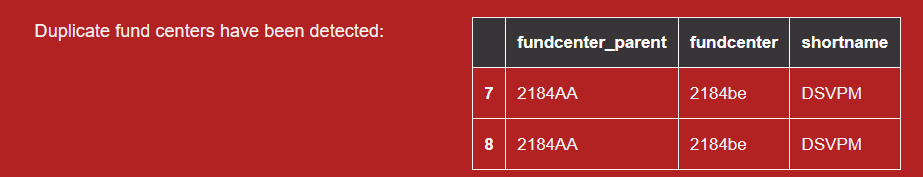

# Fund Centers

## Viewing Fund Centers

Fund centers can be viewed by anyone. The report will appear different whether or not the user is permitted to create, update or delete fund centers. The fund center view provide direct link to the cost center view that are direct subordinate of the selected cost center.

<figure markdown>
<figcaption>Viewing fund centers in edit mode</figcaption>

</figure>

<figure markdown>
<figcaption>Viewing fund centers in read only mode</figcaption>

</figure>

## Create Fund Center

Creating a fund center requires the fund center represented by its 6 characters (1111ZZ), and its name. The parent fund center must be selected from the selection list.  This mean that the parent must exist.  If not, it must be created first.

<figure markdown>
<figcaption>Fund center form for creating and updating data</figcaption>

</figure>

## Delete Fund Center

A confirmation dialog will appear before proceding with a delete action.

*Confirm the Fund Center deletion*

## Warning message

When an attempt to delete a fund center which has subordinate elements,
the request will fail and an error message will be displayed similar to
the following statement.

!!! Warning "Cannot delete some instances of model 'FundCenter' because they are referenced through restricted foreign keys : C.123456, C.999999, 2184A1, 2184A3, 2184A6"

## Upload Fund Center

!!! note

    This operation requires administration privileges.

### Source file

The required csv file must contains 3 columns as shown in the sample below.  If this is not respected, a warning message will be displayed to notify the user and the operation will abort.

<figure markdown>

</figure>

### Fund center upload form

The user select the file containing the fund centers to upload by using the ==Fund Center upload form==

<figure markdown>

</figure>

### Upload messages

Upon clicking the proceed button, the BFT will process the request and display any messages according to circumstances. Such as the one below which indicates that the column header in the file are invalid.

!!! warning "Supplying a file that contains invalid column header yields this message"

    Fund Centers upload by admin, Invalid columns header"

!!! warning "Using a file that contains fund center that already exist in the system."

    Saving fund center {'fundcenter_parent': , 'fundcenter': '0153zz', 'shortname': 'ADM Mat'} generates UNIQUE constraint failed: bft_fundcenter.fundcenter.

!!! warning "Attempt to use a file that contains more that once a given fund center"

    
    Here, the file contains twice the fund center 2184BE

!!! info "When any fund center has been successfully uploaded, number of fund center uploaded will be indicated"

    2 item(s) have been recorded.
