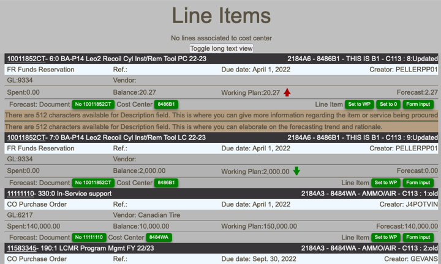
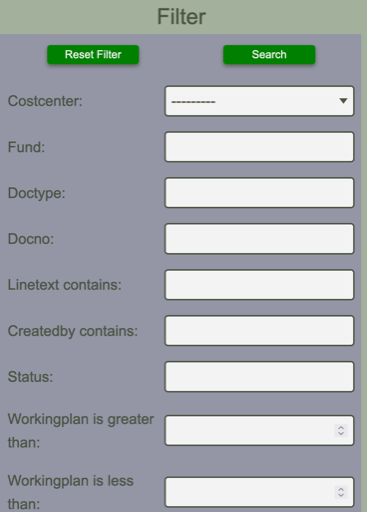
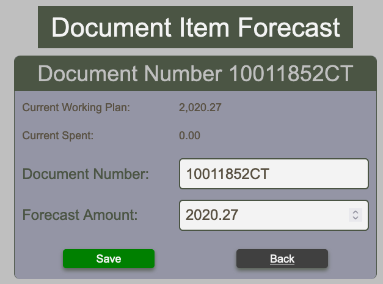
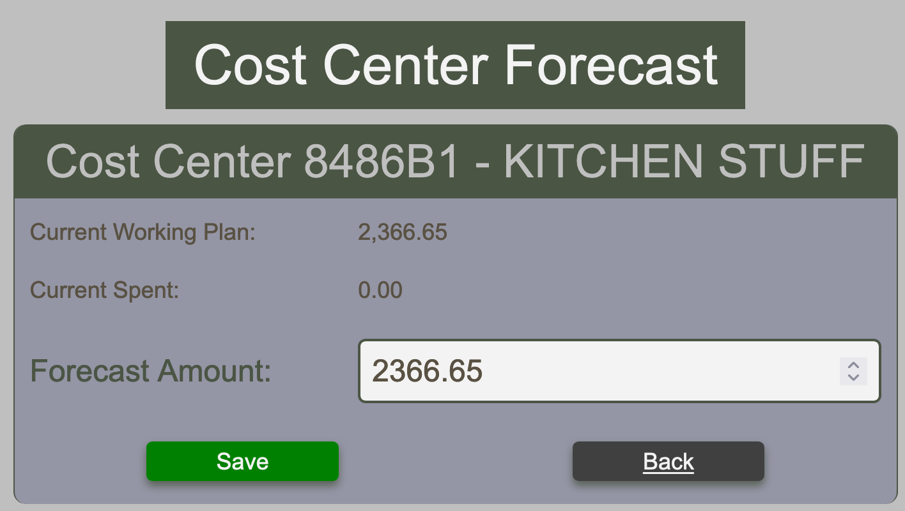
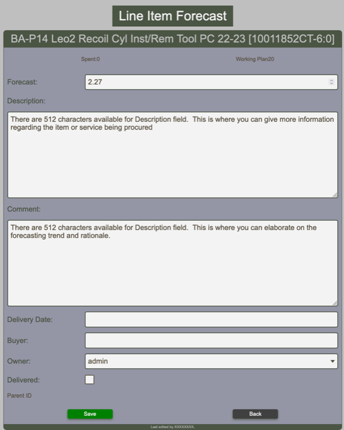
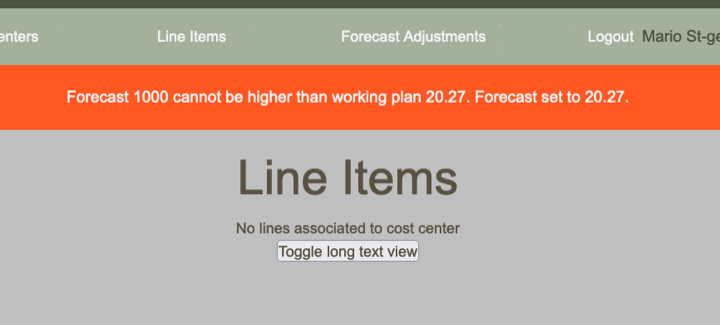

# Line Items Table

## Overview

The line item table is the entry door to line item forecasting. It displays all lines according to the applies [line item filter](line-items-warnings.md#filtering-line-items).

<figure markdown>

_Line item table overview_

</figure>

### Toggling Description and Comments

Line items descriptions and comments visibility can be toggled by clicking the Toggle long text view button located at the very top of the table.

### Filtering line items

The line item table can be filtered by mean of several fields as shown in the image below. Most available fields are free form text but the cost center which is a selection list. Many filter options used simultaneously narrow down the select. Thus select a cost center and a fund will show all lines that match the cost center <strong>AND</strong> the fund.

<figure markdown>

_Line item filtering options_

</figure>

## Forecasting Actions

The green buttons visible for each line item allows for forecasting actions. It is possible to forecast all lines for a single document (No XXXXXXX button), for a single cost center (8486B1 button) or for the line itself.

### Forecast by Document Number

<figure markdown>

_Forecasting for a Document Number_

</figure>

With this input form, one can forecast all lines that fall under the selected document number by specifying a total amount for the document. Each line item will then be assigned a forecast proportionally taking into consideration spent and working plan of each line. Upon submission, user is redirected to the line item table which is filtered by document number for convenience.

### Forecast by Cost Center

<figure markdown>

_Forecasting for a Document Number_

</figure>

With this input form, one can forecast all lines that fall under the selected cost center by specifying a total amount for the cost center. Each line item will then be assigned a forecast proportionally taking into consideration spent and working plan of each line. Upon submission, user is redirected to the line item table which is filtered by document number for convenience.

### Forecast individual line item

When the spent value is zero, it is possible to set the forecast to zero (Set to 0 button). If the spent is greater than zero, the button is not visible. Alternatively, to set the forecast equals to the working plan, one can use the button set to WP.

The Form Input button opens a form that allows for description and comment input as well as setting the forecast for the line item and some other fields as shown below.

<figure markdown>

_Individual line item forecasting form_

</figure>

When doing individual line item forecast, messages will warn you if you attempt to forecast below the spent. Such an attempt will set the forecast to the spent amount. If you attempt to forecast above the working plan, the forecast will be set to the working plan.

<figure markdown>

_Attempt to forecast above working plan_

</figure>
