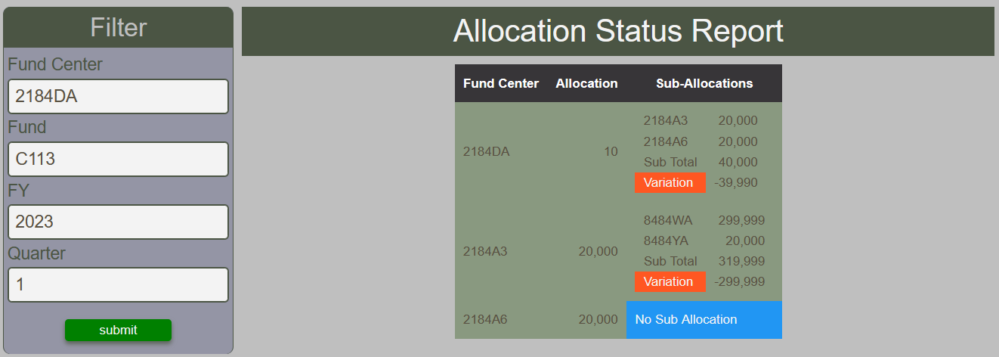

# Allocation Status Report

The Allocation Status Report outputs a tabular report that helps identify allocation discrepencies between parent and direct cost element children.  Children can be fund centers or cost centers.  It does so by summing up all allocations of direct children for a given FY, fund, quarter and parent and compares it to the allocation of the matching parent.

<figure markdown>
<figcaption>BFT Cost Center Allocations status report with input form and table</figcaption>

</figure>
