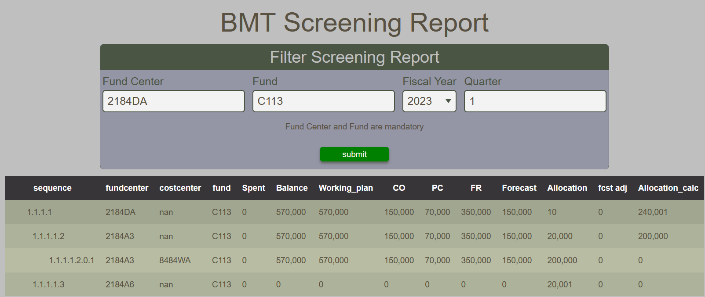

# BMT Screening Report

The BMT Screening Report provides a NP summary table of encumbrance, allocation and forecast for a given Fund Center, Fund, Fiscal Year and Quarter.  Fiscal Year and Quarter are mandatory fields.

<figure markdown>
<figcaption>BMT Screening Report with option form and table</figcaption>

</figure>
