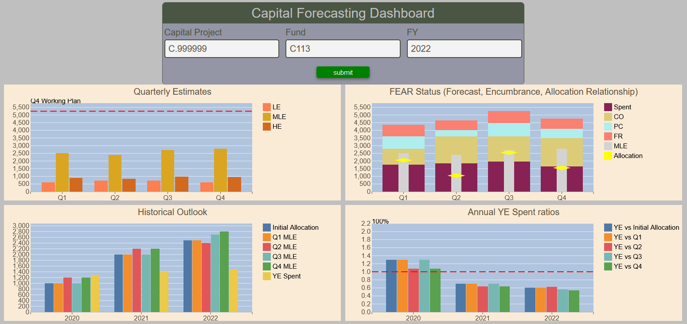

# Capital Forecasting Dashboard

The Capital Forecasting Dashboard is an amalgamation of the [Quarterly Estimates](capital-forecasting-estimate.md), [FEAR Status](capital-forecasting-fear.md), [Historical Outlook](capital-forecasting-historical-outlook.md) and [Annual Year End Spent Ratios](capital-forecasting-year-end-ratio.md) Reports.  It displays the four applicable charts but omits the data tables providing a convenient mean of seeing the capital project at a glance.

<figure markdown>
<figcaption>BFT Capital Forecasting Dashboard input form and charts </figcaption>

</figure>
