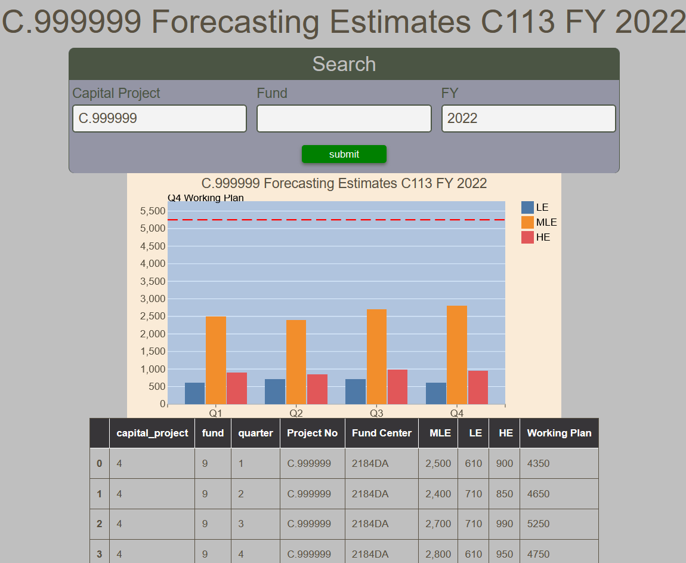

# Capital Forecasting Estimates Report

The Capital Forecasting Estimates Report displays a bar chart of the Low Estimate, Most Likely Estimate and High Estimate on a quarterly basis for a given capital project, fund and fiscal year.  All fields are mandatory.  For convenience, a table of the values is also presented.

<figure markdown>
<figcaption>BFT Capital Forecasting Estimate with input form, bar chart and data table</figcaption>

</figure>
