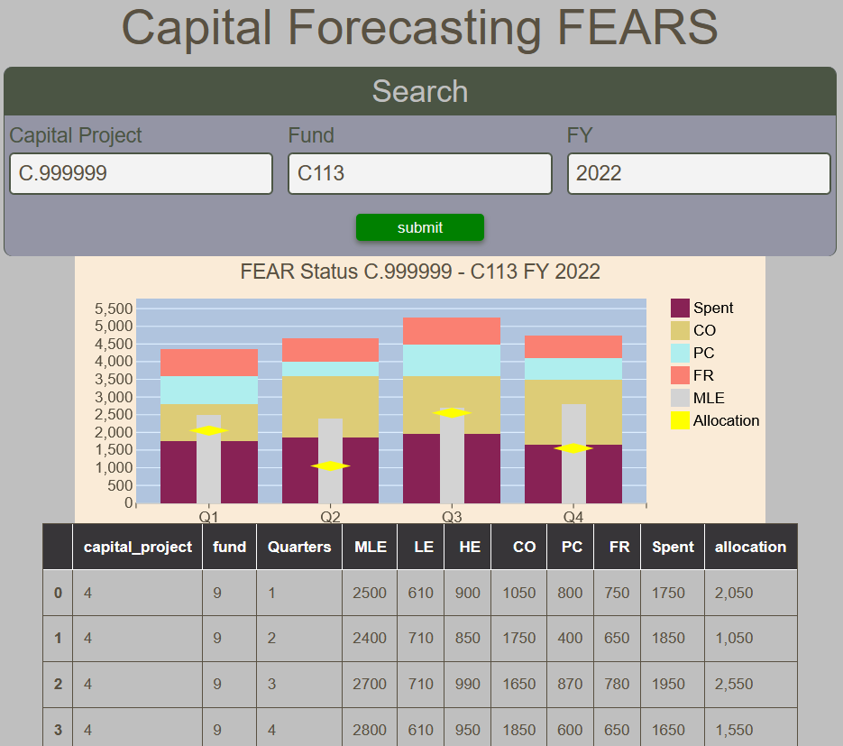

# Capital Forecasting FEAR Status Report

The Capital Forecasting FEAR (Forecasting, Encumbrance, Allocation Relationship) Report displays a stacked bar chart of the encumbrance elements (Spent, CO, PC, and FR) in relation to the Most Likely Estimate and Allocation on a quarterly basis.  All fields are mandatory.  For convenience, a table of the values is also presented.

<figure markdown>
<figcaption>BFT Capital Forecasting FEAR with input form, bar chart and data table</figcaption>

</figure>
