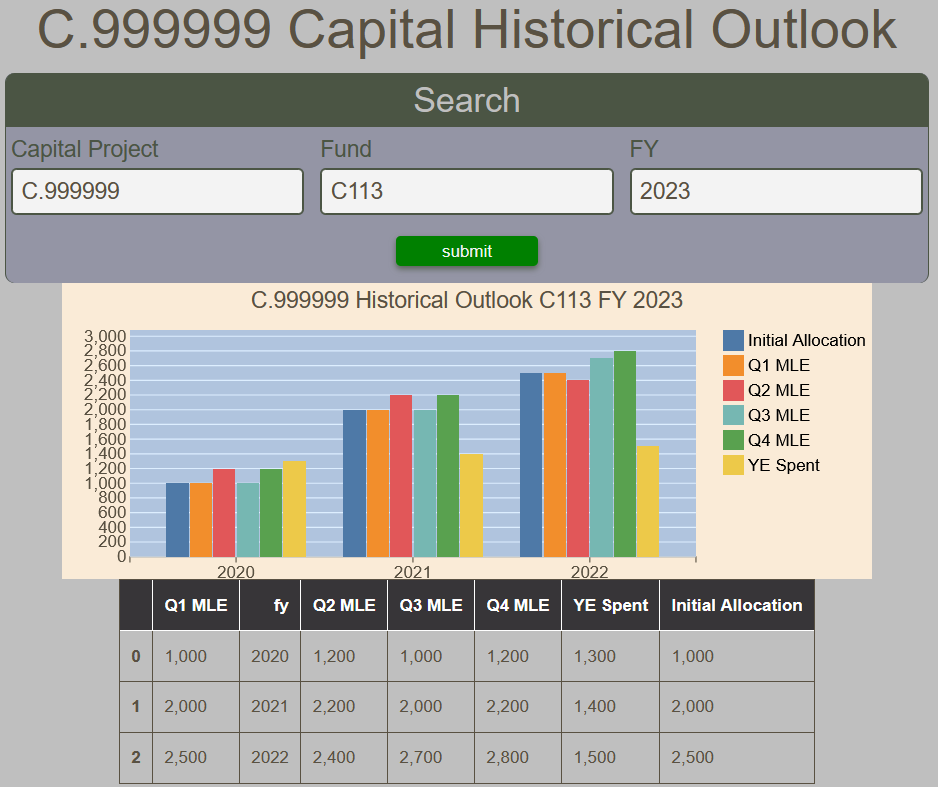

# Capital Forecasting Historical Outlook Report

The Capital Forecasting Historical Outlook Report displays a grouped bar chart by FY of the Initial Allocation along with the Most Likely Estimates of each quarter of the fiscal year for a given capital project and fund.  All fields are mandatory.  For convenience, a table of the values is also presented.

!!! Note "The report displays results up to five years back from the specified fiscal year."

<figure markdown>
<figcaption>BFT Capital Forecasting Historical Outlook with input form, bar chart and data table</figcaption>

</figure>
