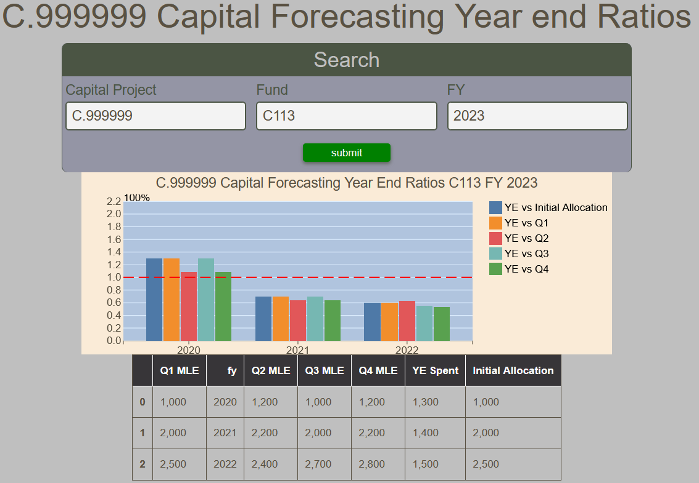

# Capital Forecasting Year End Ratios Report

The Capital Forecasting Year End Ratios Report displays a bar chart of the Year End Spent over Initial Allocation and Forecast of each quarter of the fiscal year for a given capital project, fund and fiscal year.  All fields are mandatory.  For concenience, a table of the values is also presented.

Note !!! "The report displays results of the three years preceding the selected fiscal year."

<figure markdown>
<figcaption>BFT Capital Forecasting Year End Ratios with input form, bar chart and data table</figcaption>

</figure>
