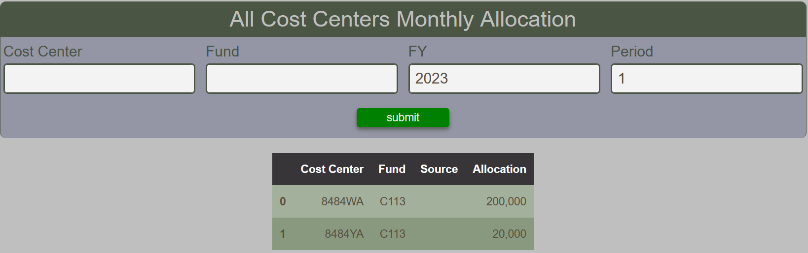

# Cost Center Allocation Report

The Cost Center Allocation Report provides a table view of all allocation recorded in the BFT for a given Fiscal Year and Period.  Cost Center and Fund are optional.

<figure markdown>
<figcaption>BFT Cost Center Allocations with option form and table</figcaption>

</figure>
