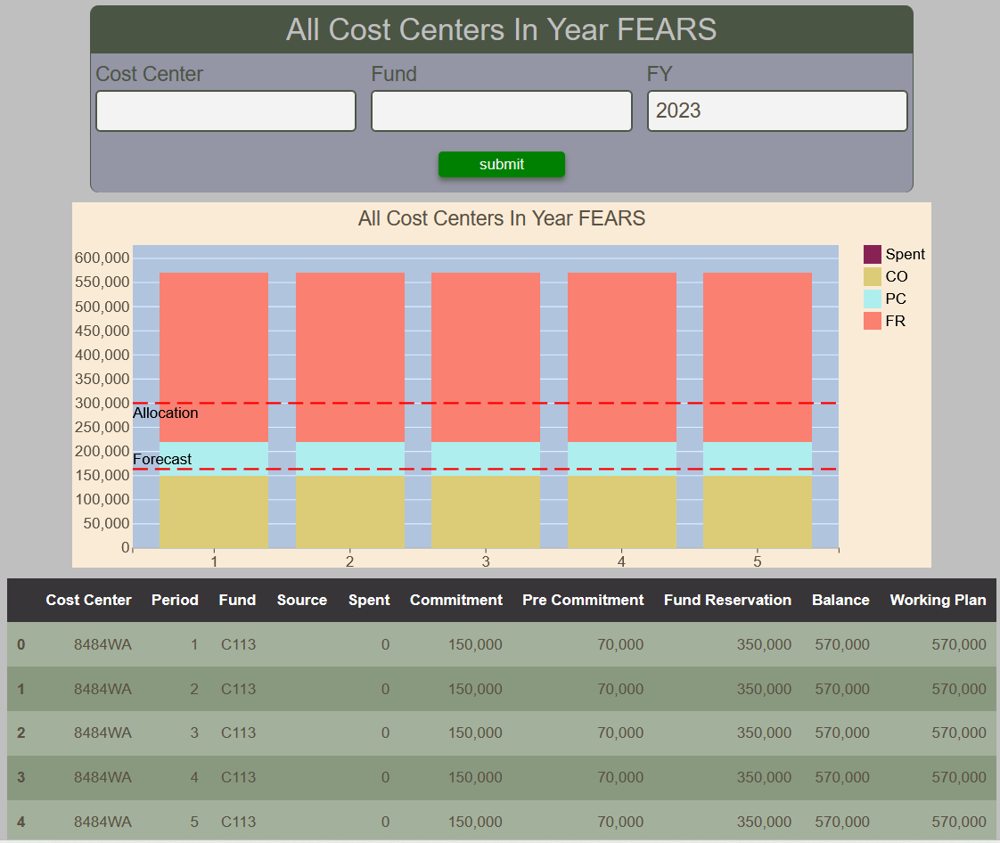

# Cost Center In Year FEAR Status Report

Cost Center In Year FEAR Status Report display a monthly stacked bar chart of Spent, Commitment, Pre Commitment and Fund Reservation for the selected cost center and fund at a given FY.  Threshold lines for allocation and forecast indicate the current values.

<figure markdown>
<figcaption>BFT Cost Center In Year Fear Status Report with input form and table</figcaption>

</figure>
