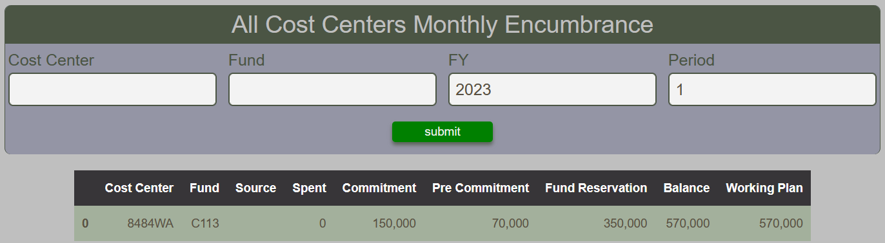

# Cost Center Monthly Encumbrance Report

The Cost Center Monthly Encumbrance Report provides a tabular summary of the line items encumbrance applicable to cost centers. Encumbrance includes Spent, commitment, Pre-commitment, Fund Reservation, Balance and Working Plan.

<figure markdown>
<figcaption>BFT Cost Center Monthly Encumbrance with input form and table</figcaption>

</figure>
