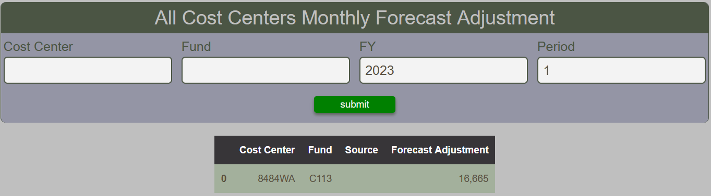

# Cost Center Monthly Forecast Adjustment

The Cost Center Monthly Forecast Adjustment Report provides a tabular summary of the forecast adjustments made to cost centers.  The comments made are not displayed.  If more than one forecast adjustment is made for a given cost center, fund, FY and period, the total will be displayed as opposed to showing all entries.

<figure markdown>
<figcaption>BFT Cost Center Monthly Forecast Adjustment with input form and table</figcaption>

</figure>
