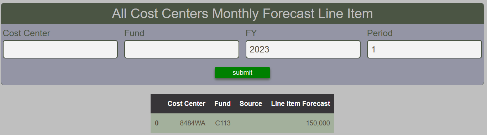

# Cost Center Monthly Forecast Line Item Report

The Cost Center Monthly Line Item Report provides a tabular summary of the line items forecast applicable to cost centers.  It does not include [forecast adjustments](costcenter-monthly-forecast-adjustment.md).

<figure markdown>
<figcaption>BFT Cost Center Monthly Line Item with input form and table</figcaption>

</figure>
