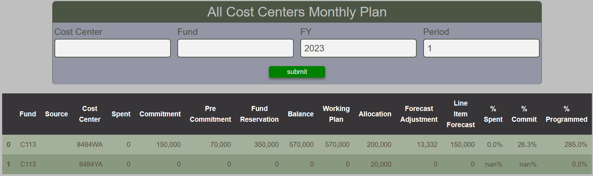

# Cost Center Monthly Plan Report

The Cost Center Monthly Plan Report provides a tabular summary of the line items plan applicable to cost centers. The plan includes all aspects of the cost center's encumbrance, along with its Allocation, Forecast Adjustment, and Line Item Forecast.

The report also includes some key ratios :

% Spent = Spent / Working Plan  
% Commit = (Spent + Commitment) / Working Plan  
% Programmed = Working Plan / Allocation  

<figure markdown>
<figcaption>BFT Cost Center Monthly Plan with input form and table</figcaption>

</figure>
