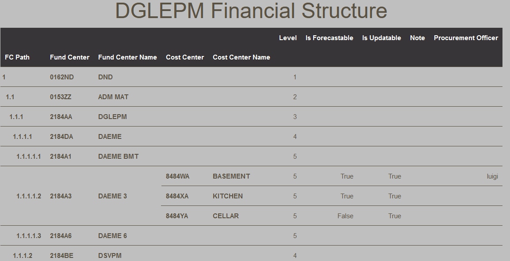

# Financial Structure

This report present the financial structure from a parent-child relationship built in the BFT.  It mimics the financial structure from DRMIS and contains additional fields.  As such, one can visualize whether or not a given cost center is forecastable or not to cite an example.

<figure markdown>
<figcaption>BFT Financial Structure</figcaption>

</figure>
