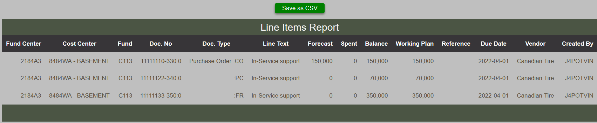

# Line Item Report

The Line Item Report outputs a tabular view of popular line items elements.  From this report, it is possible to export and save as a CSV file which can be open by a spreadsheet application such as MS Excel.

<figure markdown>
<figcaption>BFT Line item report with export button</figcaption>

</figure>

Upon clicking the Save as CSV button, the data is saved at the location as defined in your browser preferences.  The file itself is named lineitems.csv
