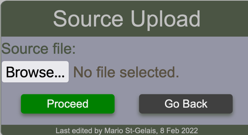

# Source

Users with appropriate permissions can insert, update and delete source metadata. This can be done through the ==Update Source Form== which is access from the ==Source== table

## Viewing sources

<figure markdown>

<figcaption>Viewing sources in read only mode</figcaption>
</figure>

<figure markdown>

<figcaption>Viewing sources in edit mode</figcaption>
</figure>

From this vire, it is possible to add a new source, modify an existing one and delete an existing one.

## Create a source

If a source is entered in UPPERCASE, it will be recorded as is. If it is entered in lowercase, the source will be capitalized.

<figure markdown>

<figcaption>Viewing the Source table to modify any of the elements</figcaption>
</figure>

If the source already exists, the form will reappear with a notification message

<figure markdown>

<figcaption>Viewing the Source table to modify any of the elements</figcaption>
</figure>

## Updating an existing source

Click the yellow pencil button beside the targeted source. The Source Entry form will open and the source field will contain the value that you can update. Make the change and click the save button. If the source is accepted, the user is redirected to the source table. If updating a source creates a duplicate, the change will be rejected and the user is redirected to the source entry form.

## Deleting a source

Click the red X button beside the targeted source. A confirmation form will appears to verify you intention to deleted the selected source.

<figure markdown>

<figcaption>Source delete confirmation</figcaption>
</figure>

Click confirm if you really want to delete the source. If BFT accepts the request, the user is redirected to the source table. If the delete action creates a conflict, a warning message will appear and the delete action will be denied.

!!! warning "Attempt to delete a source rejected"

    Cannot delete some instances of model 'Source' because they are referenced through restricted foreign keys : 8486B1

# Uploading Sources

!!! note "This operation requires administration privileges."

The required csv file must contains 1 single column as shown in the sample below.
It is good practice to define an unknown source.

<figure markdown>

</figure>

The first row must contain the header which in the case is **source**. If this is not respected, a warning message will be displayed to notify the user and the operation will abort.

The user select the file containing the sources to upload by using the ==source upload form==

<figure markdown>

</figure>

Upon clicking the proceed button, the BFT will process the request and display any messages according to circumstances. Such as the one below which indicates that the column header in the file are invalid.

!!! warning "Supplying a file that contains invalid column header yields this message"

    Fund upload by admin, Invalid columns header"

!!! warning "Using a file that contains sources that already exist in the system."

    Saving source {'source': 'capital program'} generates UNIQUE constraint failed: costcenter_source.source..

!!! info "When any fund has been successfully uploaded, number of funds uploaded will be indicated"

    2 item(s) have been recorded.
