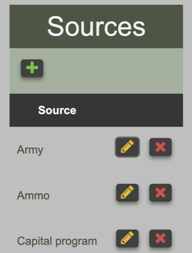
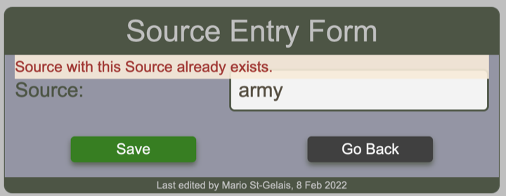
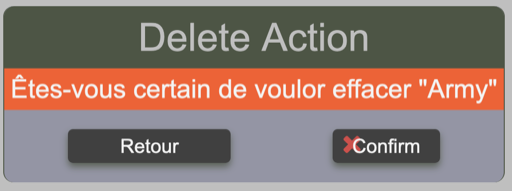

# Managing Source Metadata

Users with appropriate permissions can insert, update and delete source metadata. This can be done through the ==Update Source Form== which is access from the ==Source== table

<figure markdown>

<figcaption>Viewing the Source table to modify any of the elements</figcaption>
</figure>

From this table, it is possible to add a new source, modify an existing one and delete an existing one.

## Adding a new source

Click the green plus (+) sign button to open the Source Entry form, enter the new source name and click the save button. If the source is accepted, the user is redirected to the source table.

If a source is entered in UPPERCASE, it will be recorded as is. If it is entered in lowercase, the source will be capitalized.

<figure markdown>

<figcaption>Viewing the Source table to modify any of the elements</figcaption>
</figure>

If the source already exists, the form will reappear with a notification message

<figure markdown>

<figcaption>Viewing the Source table to modify any of the elements</figcaption>
</figure>

## Updating an existing source

Click the yellow pencil button beside the targeted source. The Source Entry form will open and the source field will contain the value that you can update. Make the change and click the save button. If the source is accepted, the user is redirected to the source table. If updating a source creates a duplicate, the change will be rejected and the user is redirected to the source entry form.

## Deleting a source

Click the red X button beside the targeted source. A confirmation form will appears to verify you intention to deleted the selected source.

<figure markdown>

<figcaption>Source delete confirmation</figcaption>
</figure>

Click confirm if you really want to delete the source. If BFT accepts the request, the user is redirected to the source table. If the delete action creates a conflict, a warning message will appear and the delete action will be denied.

!!! warning "Attempt to delete a source rejected"

    Cannot delete some instances of model 'Source' because they are referenced through restricted foreign keys : 8486B1
