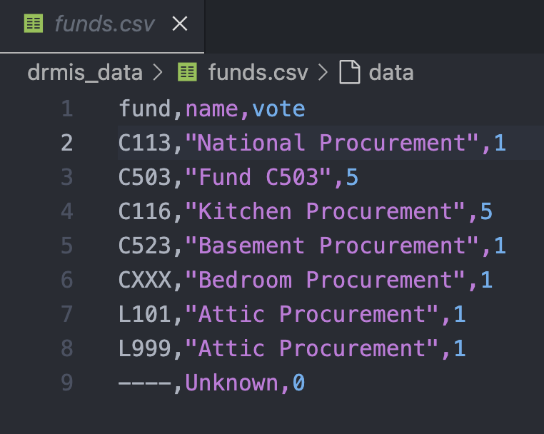

# Uploading Funds

!!! note

    This operation requires administration privileges.

The required csv file must contains 3 columns as shown in the sample below.
It is good practice to define an unknown fund using four dashes (----) and a meaningful name to indicate that the fund is unknown.

<figure markdown>

</figure>

The first row contains the header and the name of the elements in the header must be exactly as shown here. If this is not respected, a warning message will be displayed to notify the user and the operation will abort.

The user select the file containing the funds to upload by using the ==fund upload form==

<figure markdown>

</figure>

Upon clicking the proceed button, the BFT will process the request and display any messages according to circumstances. Such as the one below which indicates that the column header in the file are invalid.

!!! warning "Supplying a file that contains invalid column header yields this message"

    Fund upload by admin, Invalid columns header"

!!! warning "Using a file that contains funds that already exist in the system."

    Saving fund {'fund': 'cnn13', 'name': 'National Procurement', 'vote': 1} generates UNIQUE constraint failed: costcenter_fund.fund.

!!! info "When any fund has been successfully uploaded, number of funds uploaded will be indicated"

    2 item(s) have been recorded.
