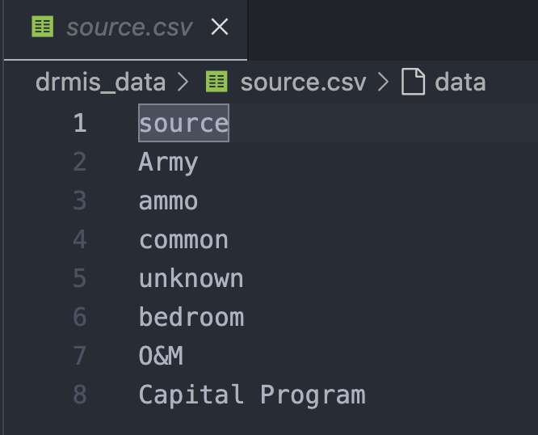
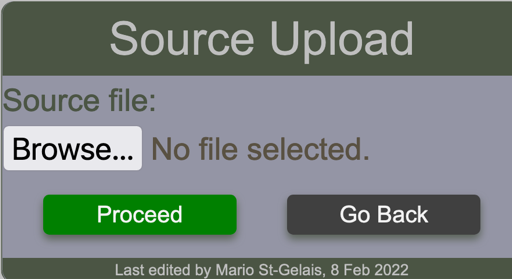

# Uploading Sources

!!! note

    This operation requires administration privileges.

The required csv file must contains 1 single column as shown in the sample below.
It is good practice to define an unknown source.

<figure markdown>

</figure>

The first row must contain the header which in the case is **source**. If this is not respected, a warning message will be displayed to notify the user and the operation will abort.

The user select the file containing the sources to upload by using the ==source upload form==

<figure markdown>

</figure>

Upon clicking the proceed button, the BFT will process the request and display any messages according to circumstances. Such as the one below which indicates that the column header in the file are invalid.

!!! warning "Supplying a file that contains invalid column header yields this message"

    Fund upload by admin, Invalid columns header"

!!! warning "Using a file that contains sources that already exist in the system."

    Saving source {'source': 'capital program'} generates UNIQUE constraint failed: costcenter_source.source..

!!! info "When any fund has been successfully uploaded, number of funds uploaded will be indicated"

    2 item(s) have been recorded.
