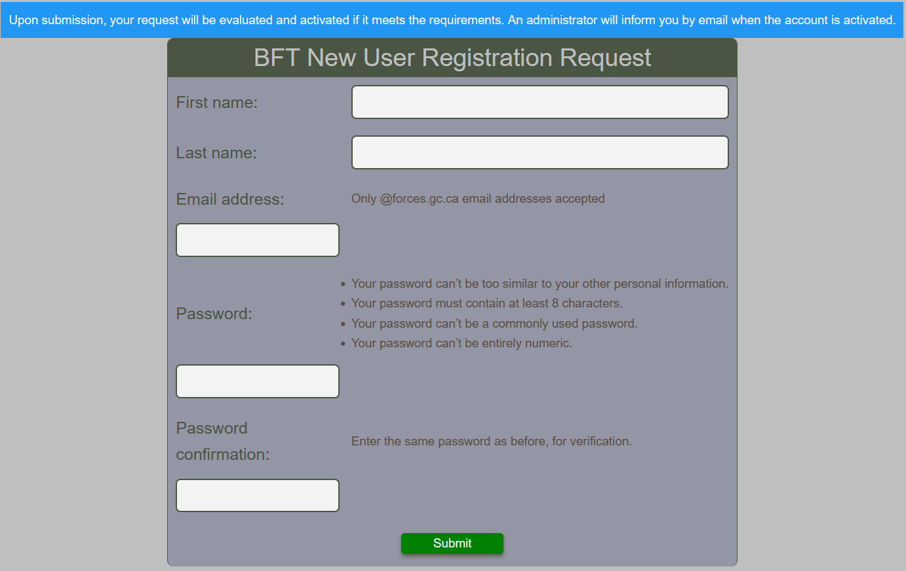
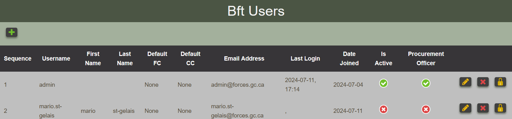
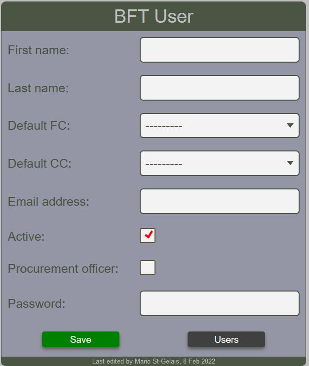
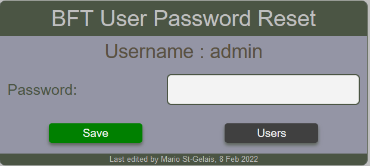
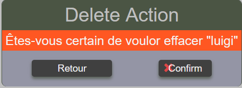

# Users

## Registering new User

Users who need access to the BFT can submit an online request by filling the form as shown below.  Upon submission, the request will be evaluated and access will be granted according to the nature of the business required by the user.  User maybe contacted to clarify the needs.

<figure markdown>

*Fill and submit this form to request access to the BFT*

</figure>

## Viewing users

Given the privileges, some BFT users are mandated to manage the aspects of the BFT user community.  This is achieved by using the User Table View as show below.

<figure markdown>

*Viewing the users registered to the BFT*

</figure>

## Create user

An administrator can register a new user by completing the BFT User Form as shown below.  Once created, the administrator mus transmit the password to the user.  This form is also used to modify the user related information.

<figure markdown>

*Registering a new user by an admin staff*

</figure>

## Reset user password

An administrator can reset a user password.  The administrator must forward to the user the new password.

<figure markdown>

*Resetting a user password*

</figure>

## Delete user

A confirmation dialog will appear before proceding with a delete action.

<figure markdown>

*Confirm the user deletion*

</figure>
