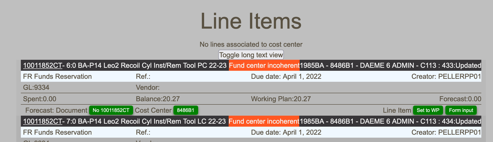

# Line items management

## Warnings

### Wrong fund center

If for a given line item there exist a discrepency between the fund center reported in the encubrance report and the BFT financial structure, incoherency will be reported in the line item view.

_Line item incoherent fund center_
