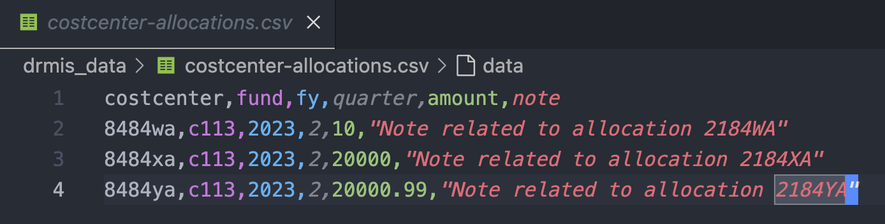
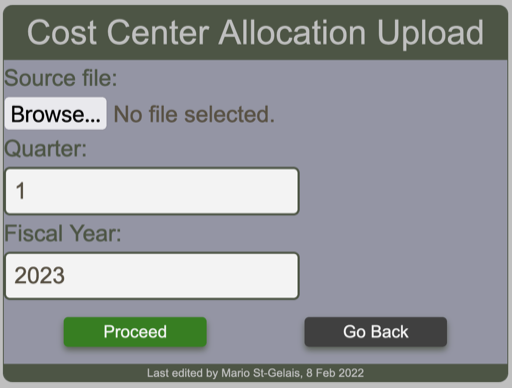

# Uploading Cost Center Allocations

!!! note

    This operation requires administration privileges.

## Source file

The required csv file must contains 6 columns as shown in the sample below.
The quarter column must be a number between 1 and 4. The amount numbers must not contain any separator other than the dot decimal separator. The note entries are not mandatory. The text must be surrounded by double quotes.

<figure markdown>

</figure>

The first row contains the header and the name of the elements in the header must be exactly as shown here. If this is not respected, a warning message will be displayed to notify the user and the operation will abort.

## Cost center allocation upload form

The user select the file containing the cost centers to upload by using the ==cost center allocation upload form==

<figure markdown>

</figure>

### Upload messages

Upon clicking the proceed button, the BFT will process the request and display any messages according to circumstances. Such as the one below which indicates that the column header in the file are invalid.

!!! warning "Supplying a file that contains invalid column header yields this message"

    Cost centers upload by admin, Invalid columns header"

And there are more potential messages.

!!! warning "Indicating a quarter that does not match the quarter indicated in the file."

    Error allocation upload by admin, Quarter data does not match request (2 does not match 1)

!!! warning "Indicating a fiscal year that does not match the file content."

    FY request does not match dataset

!!! warning "The source file contains more that one quarter."

    Quarters not all matching. admin, 2023, 2

!!! warning "The source file contains an unknown fund"

    Fund(s) not found during check fund ['C11']

!!! warning "The source file contains an unknown cost center."

    Cost centers not found during check cost centers ['8484WW']

!!! warning "The source file contains duplicate cost center - fund pair."

    Saving cost center allocation {'costcenter': , 'fund': , 'fy': 2023, 'quarter': 2, 'amount': 20000.0, 'note': 'Note related to allocation 2184XA', 'owner': >} generates UNIQUE constraint failed: costcenter_costcenterallocation.fund_id, costcenter_costcenterallocation.costcenter_id, costcenter_costcenterallocation.quarter, costcenter_costcenterallocation.fy.
