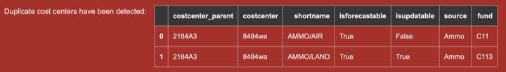

# Uploading Cost Centers

!!! note

    This operation requires administration privileges.

## Source file

The required csv file must contains 7 columns as shown in the sample below.
The first two colummns represents a parent - child relationship. All sources, funds and costcenter_parent (fund centers) must exits in the BFT for the upload to be successful.

<figure markdown>

</figure>

The first row contains the header and the name of the elements in the header must be exactly as shown here. If this is not respected, a warning message will be displayed to notify the user and the operation will abort.

## Cost center upload form

The user select the file containing the cost centers to upload by using the ==cost center upload form==

<figure markdown>

</figure>

### Upload messages

Upon clicking the proceed button, the BFT will process the request and display any messages according to circumstances. Such as the one below which indicates that the column header in the file are invalid.

!!! warning "Supplying a file that contains invalid column header yields this message"

    Cost centers upload by admin, Invalid columns header"

!!! warning "Using a file that contains cost center that already exist in the system."

    Saving cost center {'costcenter_parent': , 'costcenter': '8484wa', 'shortname': 'AMMO/AIR', 'isforecastable': True, 'isupdatable': False, 'source': , 'fund': } generates UNIQUE constraint failed: costcenter_costcenter.costcenter

!!! Warning "Attempt to use a fund that does not exist in the BFT"

    Cost center 8484wa fund (C11) does not exist, no cost centers have been recorded.

!!! warning "Attempt to use a file that contains more that once a given cost center"

    
    Here, the file contains twice the cost center 8484WA

!!! info "When any cost center has been successfully uploaded, number of cost center uploaded will be indicated"

    2 item(s) have been recorded.
