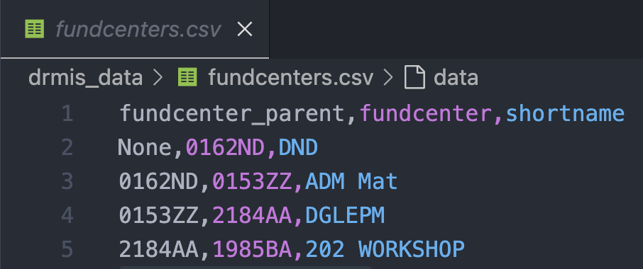
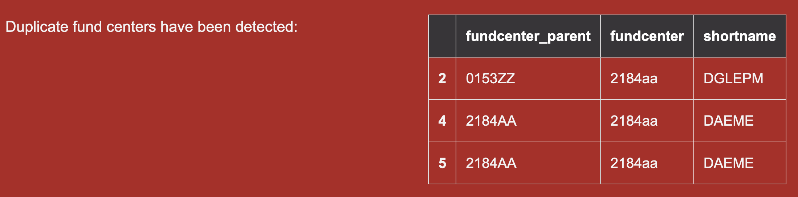

# Uploading Fund Centers

!!! note

    This operation requires administration privileges.

## Source file

The required csv file must contains 3 columns as shown in the sample below.
The first two colummns represents a parent - child relationship. The file must be built from top ancestor and down to the last child in such a way that when the BFT creates the financial structure, it records the parent before the child. Just like in real life
One fund center must have fundcenter_parent identified as None.

<figure markdown>

</figure>

The first row contains the header and the name of the elements in the header must be exactly as shown here. If this is not respected, a warning message will be displayed to notify the user and the operation will abort.

## Fund center upload form

The user select the file containing the fund centers to upload by using the ==fund center upload form==

<figure markdown>

</figure>

### Upload messages

Upon clicking the proceed button, the BFT will process the request and display any messages according to circumstances. Such as the one below which indicates that the column header in the file are invalid.

!!! warning "Supplying a file that contains invalid column header yields this message"

    Fund centers upload by admin, Invalid columns header"

!!! warning "Using a file that contains fund center that already exist in the system."

    Saving fund center {'fundcenter_parent': None, 'fundcenter': '0162nd', 'shortname': 'DND'} generates UNIQUE constraint failed: costcenter_fundcenter.fundcenter.

!!! warning "Attempt to use a file that contains more that once a given fund center"

    
    Here the file contains three times the fund center 2184AA.

!!! info "When any fund center has been successfully uploaded, number of fund center uploaded will be indicated"

    2 item(s) have been recorded.
