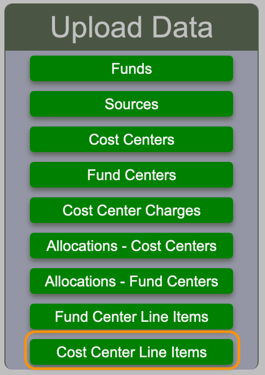
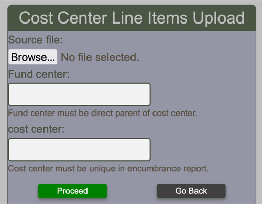
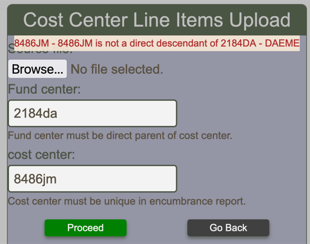

# Uploading Line Items

Line items can be uploaded in the BFT in two manners. During BFT normal operations, a designated person performs the upload for the entire division on a daily basis and normally in the morning. This is known as an upload at the fund center level. Executing such an operation has the effect of creating "orphan lines". An orphan line is a line that exists in the BFT, but does not exist in the Encumbrance Report. Such orphan lines are not erased from the BFT, but their encumbrance and forecast are set to zero.

A more practical approach is to perform an upload the the cost center level. This operation can be executed by designated people who have the option to perform an upload at their convenience any time during the day. This approach will also create orphan lines, but for the targeted cost center only.

## Upload line items for Cost Center

The upload of a cost center necessitates a DND Cost Center Encumbrance Report from DRMIS and must contain specific columns with names as defined by DRMIS.

The report must contain only the lines for one single cost center which also mean only one fund center which must be the direct parent of the targeted cost center.

Both fund center and cost center must exist in the BFT.

<figure markdown>

{align=right}

<figcaption>Selecting Uploading line items for Cost Center</figcaption>
</figure>

Three pieces of information are mandatory and must be supplied to the input form : The file that contains the encumbrance report, the fund center and the cost center, child of the fund center.

<figure markdown>

{align=right}

<figcaption>Cost Center line items upload form</figcaption>
</figure>
There are several checks that are performed when the proceed button is pressed and messages will be displayed if anything is not acceptable to the BFT.  The DRMIS report must be supplied as is without any alterations.

-   The fund center must exist in the BFT.
-   The cost center must be a child of the fund center.
-   All funds present in the report must exist in the BFT.
-   The report must contain only one fund center.
-   The report must contain only one cost center.
-   The report header must mention the base fiscal year.
-   The report header must mention the Funds center.
-   The report header as defined by DRMIS must indicate the same fund center as the one indicated in the input form.
-   The provided file must be a DND cost center encumbrance report. This information is part of the DRMIS report header.
-   The provided file must have a column header line that matches what the BFT expect.

<figure markdown>

{align=right}

<figcaption>Cost Center line items upload form with typical error</figcaption>
</figure>
If any of the above fails, the upload process will not take place.

During the upload process, the BFT will manipulate the line items in the following ways:

-   Lines found to be orphan will have their encumbrance and forecast set to zero.
-   A fund center integrity check is performed by comparing the fund center assigned to a line item with the fund center assigned to the cost center as defined in the BFT financial structure report. Discrepancies ([Wrong fund center](../line-items-warnings.md#wrong-fund-center)) will be indicated in the screening report
-   Lines without a document type will be assigned one based on the encumbrance type. Example, encumbrance type "Purchase Requisitions" will be assigned PC as document type.
-   When a line item is new, record its encumbrance for historical purposes.
-   Adjust the forecast of line items. When forecast is below spent, set the forecast to spent. When the forecast is above working plan, set the forecast to working plan
